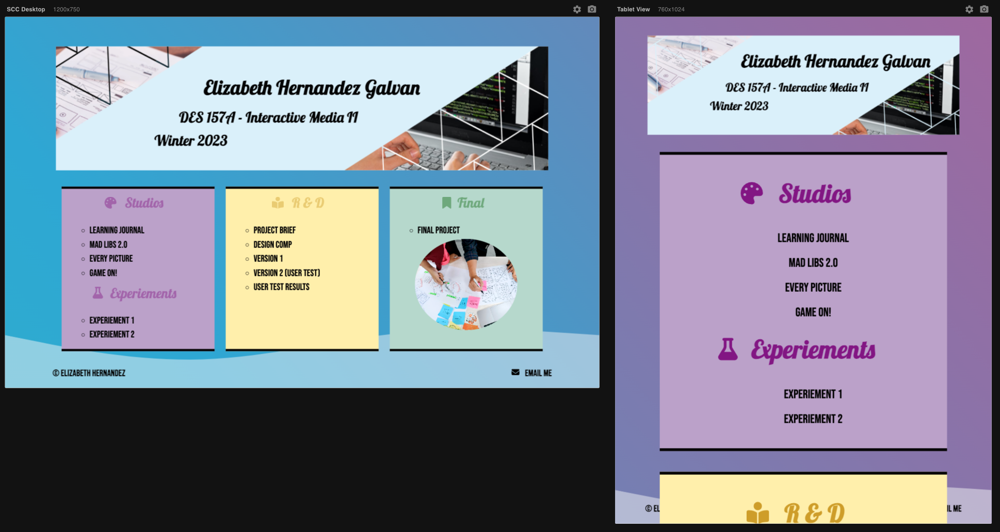
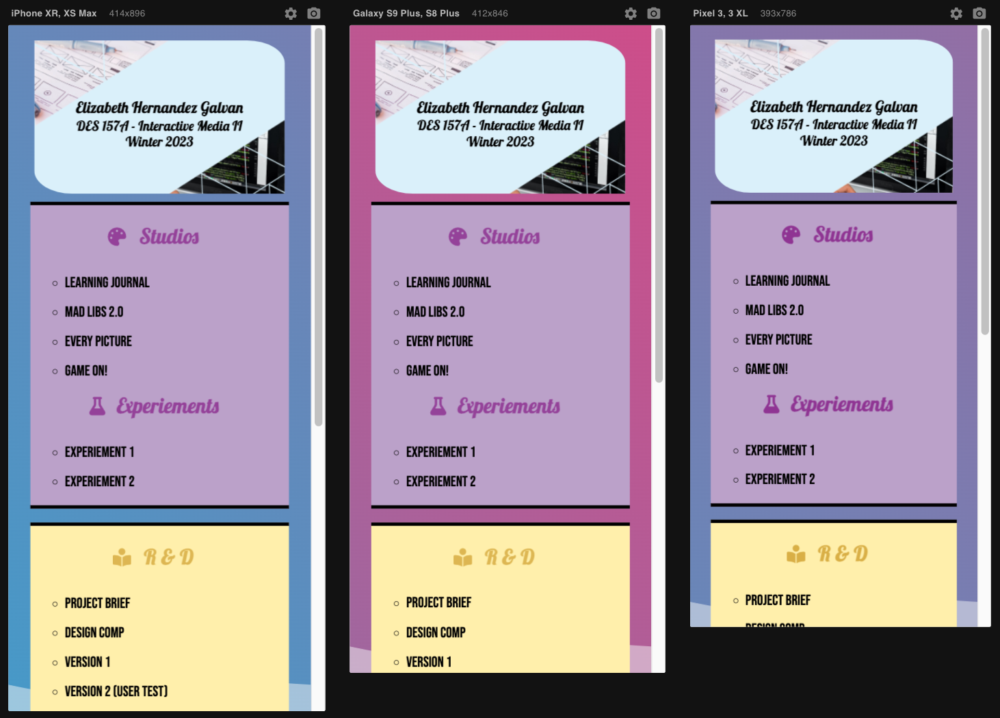

# Des157a Winter 2022
This repo contains my portal which serves as a Table of Contents for the work I will produce during the duration of this course.

## Portal Page Responsive Layout:

  

  

## Goals
- Design and develop a user-friendly portal that:
  - Adheres to the specified visual layout detailed below
  - Effectively integrates design principles using design elements such as graphics, images (that you make yourself), colors and fonts, etc
  - UI Best Practice: Make sure to consider readability by using a font that is not only designed for the screen but also works well for copy, and by choosing a color scheme that offers contrast between the type and the background
- Is designed for a desktop/laptop viewport of approximately 1200px x 750px
- Does not require scrolling when viewed at 1200px x 750px
- Is an effective and engaging experience for your target audience: your instructor, TA, tutor and classmates
- Review, sharpen and write lean, mean and clean, semantic HTML
- Create an external CSS stylesheet to define all visual formatting using current standards
- Practice using time-based CSS properties by creating an interactive banner using CSS transitions, transforms and keyframes
- Extra Credit: Responsive design
